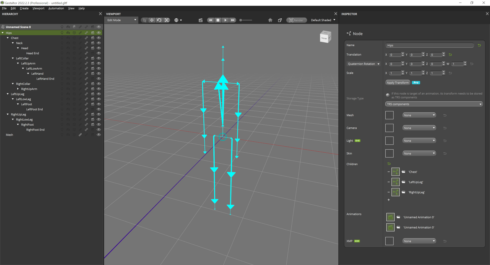

[](https://github.com/KhronosGroup/glTF/tree/master/specification/2.0)

# Biovision BVH to glTF 2.0 converter

bvh2gltf2 is a command line tool for converting [Biovision BVH](https://research.cs.wisc.edu/graphics/Courses/cs-838-1999/Jeff/BVH.html) to glTF 2.0.  
  
Following a screenshot of a converted BVH file to glTF 2.0 opened in [Gestaltor](https://gestaltor.io/) (showing skins and bones):  


Usage: `bvh2gltf2.exe [-f Example1.bvh]`  

```
-f Example1.bvh Use another BVH file beside the included example.  
```

## BVH Example Data

* [Bandai-Namco-Research-Motiondataset](https://github.com/BandaiNamcoResearchInc/Bandai-Namco-Research-Motiondataset)  

## Software Requirements

* C/C++ 17 compiler e.g. gcc or Visual C++  
* [Eclipse IDE for C/C++ Developers](https://www.eclipse.org/downloads/packages/release/2022-03/r/eclipse-ide-cc-developers)  

## Viewing

Try out the generated glTF in [Gestaltor](https://gestaltor.io/).  
